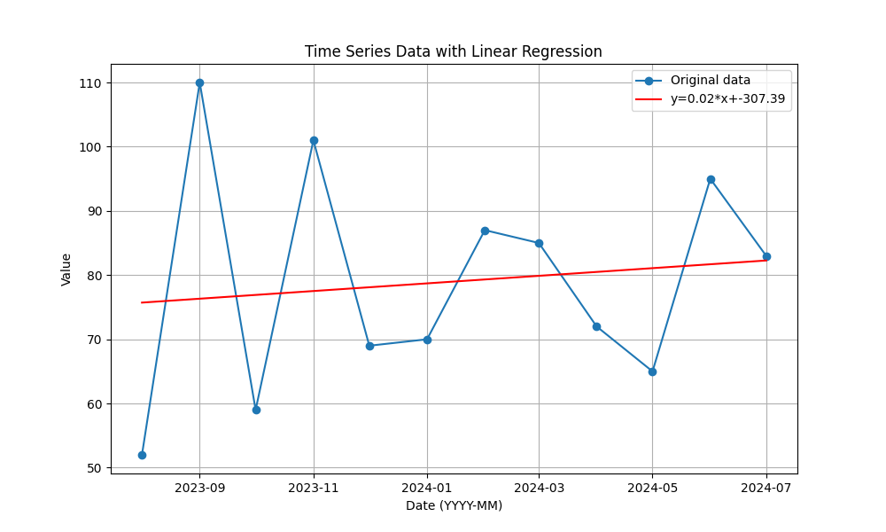

# REST API Documentation

## Introduction

This document is here to help you get started with using our API. If you're looking for more technical details, you'll find them [__here__](https://scorpion.bi.denbi.de/docs). This guide is for anyone with some basic coding knowledge who wants to learn the specifics of the Scorpion REST API. This guide is designed as one consecutive script so check above code snippets if a reference is unclear. It was originally written for Python, but you can easily translate everything to your favorite programming language. Feel free to contact us, if you want to contribute your code snippets for other programming languages. You can also find the Python code for using the `scorpion_client`.

In this tutorial, you will learn how to create an API Token, how to submit KPI measurements and retrieve data from Scorpion. 

## Prerequisites

Before we jump into the tutorial, make sure you're registered to your Scorpion instance. If you're new to Scorpion, we've got a handy guide for you to learn how to [__register__](users.md). If you're not using the hosted instance, just reach out to your instance administrator — they're there to help! Once you're registered, sign in and head over to the User Profile and make sure you're a member of at least one service provider. And don't forget to check that this service provider has at least one service. 

## Getting started

Before you begin, we just need to ask you to create an API key(1). If you're not already there, just navigate to your User Profile to get started. You'll find a button that says `CREATE API KEY` at the bottom of your Profile. Click it, and a dialog will open where you can give this key a name. Click the `Next` button, and you'll be able to copy the API key to your clipboard.
{ .annotate }

1.  An API Key is a static string that can be used by your application to authenticate to Scorpion. It is bound to your account, so you should keep it secret to yourself.

!!! warning "Attention"

    Just a quick note to remind you to keep this API key safe and sound. You won't be able to see it again, but don't worry! If you happen to lose it, you can always come back here to delete the old one and create a new one.

=== "Python"
    
    To use your key with the API, you simple add it to the custom header `X-API-Key` of every request you are making to Scorpion. For this we create a header dictionary that we can reuse for this purpose.
    ``` python title="main.py"
        import os
        import requests
        from dotenv import load_dotenv

        load_dotenv()

        headers = {
            'X-API-Key': os.getenv('API_KEY'),
        }

        base_url = 'https://scorpion.bi.denbi.de/'
    ```

=== "Scorpion Client"
    To use the Scorpion client for interaction with Scorpion, you need to instantiate the `ScorpionClient` class. This requires your API key as well as the base URL.  
    ```python title="main.py"
    from scorpion_client import ScorpionClient

    client = ScorpionClient(os.getenv('BASE_URL'), os.getenv('API_KEY'))
    ```

## List all available services

=== "Python"
    
    As a first step, we want to list all the services, for which we can submit KPI measurements. For this we call the `/aai/details` endpoint and search for the providers we are member for.
    ``` py title="main.py"
    response = requests.get(base_url + '/aai' + '/details', headers=headers)
    response.raise_for_status()

    providers = response.json()['providers']
    ```

    We then collect all services of the providers. You can either request the service for one provider or request multiple providers by using the `provider` query parameter with a comma-separated list. For the purpose of this tutorial we will simply use the first service returned in the following snippets.

    ``` py title="main.py"
    params = {
        'provider': ','.join(providers)
    }
    response = requests.get(base_url + '/api/v1/services', params=params, headers=headers)
    response.raise_for_status()
    
    services = response.json()['result']

    print(services)

    service = services[0]
    ```

=== "Scorpion Client"

    As a first step, we want to list all services, for which we can submit KPI measurements. The client provides a function `get_services()` that retrieves all services you can submit KPI measurements for. For the purpose of this tutorial we will simply use the first service returned in the following snippets.

    ```py title="main.py"
    services = client.get_services()

    print(services)

    service = services[0]
    ```

## List Indicators

=== "Python" 

    To submit KPI measurements, we first need to know, which KPI we want to measure and the necessity of those measurements. For this, we once again call the API and print out the indicators for our service. 
    ``` py title="main.py"
    params = {
        'service': service['abbreviation']
    }
    response = requests.get(f"{base_url}/api/v1/indicators", params=params, headers=headers)
    response.raise_for_status()

    for indicator in [indicator for indicator in response.json()['result'] if indicator['selected']]:
        for category in [category for category in indicator['categories'] if category['name'] == service['category']]:
            print(f"{indicator['name']}: {category['necessity']}")
    ```

    The output will look something similar to this, depending on your services KPI set.

    ```console
    Actions: recommended
    Actions per Visit: optional
    Citations: optional
    Helpdesk Tickets: mandatory
    Hits: optional
    Pageviews: recommended
    Support Tickets: recommended
    Unique Users: mandatory
    Users: optional
    Visit duration: optional
    Visits: recommended
    ```
=== "Scorpion Client"

    To submit KPI measurements, we first need to know, which KPI we want to measure and the necessity of those measurements. For this, we once again call the `get_service_indicators()` method and print out the indicators.

    ```py title="main.py"
    indicators = client.get_service_indicators(service)
    print(indicators)
    ```

    The output will look similar to this, depending on your service's KPI set.

    ```console
    [
        Indicator(name='Actions', necessity='recommended', description='Number of actions performed (page views, downloads, searches, outlinks).'), 
        Indicator(name='Actions per Visit', necessity='optional', description='Average number of actions per visit.'), 
        Indicator(name='Citations', necessity='optional', description='Number of citations of the publication(s) describing the service.'), 
        Indicator(name='Helpdesk Tickets', necessity='mandatory', description='Number of user requests regarding the service thorugh the Helpdesk.'), 
        Indicator(name='Hits', necessity='optional', description='Number of hits without robots.'), 
        Indicator(name='Pageviews', necessity='recommended', description='Number of times a page has been viewed'), 
        Indicator(name='Support Tickets', necessity='recommended', description='Number of user requests regarding the service.'), 
        Indicator(name='Unique Users', necessity='mandatory', description='Number of unique users without robots.'),
        Indicator(name='Users', necessity='optional', description='Number of registered users\t.'), 
        Indicator(name='Visit duration', necessity='optional', description='Average duration of the visits (session time).'), 
        Indicator(name='Visits', necessity='recommended', description='Number of visits of all visitors (default 30min session) without robots.')
    ]
    ```

## Submit KPI measurements

Now that we know the indicators for our service, we need to collect the measurements from the monitoring service. Scorpion does not provide a monitoring service itself, so you need to collect the metrices yourself and send the accumulated results to Scorpion. If you don't have such a monitoring service, you can e.g. set up a [__Matomo on-premise__](https://matomo.org/matomo-on-premise/) instance for free. 

Using the API, service providers can submit measurements on a daily or monthly basis. The format is either `YYYY-MM-DD` or `YYYY-MM`. 

??? note "Note"

    Keep in mind that monthly measurements will be stored in Scorpion for the first day of the month. So mixing daily and monthly submissions needs to be considered carefully. The web interface only allows for monthly submission so this is considered an expert feature!

For the purpose of this tutorial, we will ignore this part as it depends on your solution. We therefore will simulate data by submitting random measurements. The `scorpion_client` comes with data source plugins which you can use to connect e.g. to a matomo instance. Check out the package's [__documentation__](https://scorpion-client.rtfd.io) for more details. 

!!! danger "Attention"

    You should __never__ do this in the production instance! The following code is solely to show you how the Scorpion API can be used. If you are unsure in how to use the Scorpion API and want to test your code first, contact your instance administrator for solutions.

=== "Python"
    ```py title="main.py"
    import random

    date = '2024-08-08'
    measurements = []
    for indicator in [indicator for indicator in response.json()['result'] if indicator['selected']]:
        for category in [category for category in indicator['categories'] if category['name'] == service['category']]:
            measurements.append({
                'kpi': indicator['name'],
                'date': date,
                'value': random.randint(0, 100)
            })

    ```

    With this done, your measurements should look similar to this.

    ```console
    [
        {'kpi': 'Actions', 'date': '2024-08-08', 'value': 84}, 
        {'kpi': 'Actions per Visit', 'date': '2024-08-08', 'value': 85}, 
        {'kpi': 'Citations', 'date': '2024-08-08', 'value': 27}, 
        {'kpi': 'Helpdesk Tickets', 'date': '2024-08-08', 'value': 6},
        {'kpi': 'Hits', 'date': '2024-08-08', 'value': 26}, 
        {'kpi': 'Pageviews', 'date': '2024-08-08', 'value': 32}, 
        {'kpi': 'Support Tickets', 'date': '2024-08-08', 'value': 73}, 
        {'kpi': 'Unique Users', 'date': '2024-08-08', 'value': 71}, 
        {'kpi': 'Users', 'date': '2024-08-08', 'value': 56}, 
        {'kpi': 'Visit duration', 'date': '2024-08-08', 'value': 27}, 
        {'kpi': 'Visits', 'date': '2024-08-08', 'value': 89}
    ]
    ```

    All that is left now is to submit the results. 


    ```python title="main.py"
    params = {
        'service': service['abbreviation']
    }
    response = requests.post(f"{base_url}/api/v1/measurements", params=params, json=measurements, headers=headers)
    response.raise_for_status()

    print(response.json())
    ```

=== "Scorpion Client"

    ```py title="main.py"
    import random

    form = client.prepare_indicator_form(service, ['2024-08-08'])
    for indicatorValue in form:
        indicatorValue.value = random.randint(0,100)
    ```

    With this done, the form should look similar to this.

    ```console
    [
        IndicatorValue(kpi='Actions', date='2024-09', value=37),
        IndicatorValue(kpi='Actions per Visit', date='2024-09', value=37),
        IndicatorValue(kpi='Citations', date='2024-09', value=13),
        IndicatorValue(kpi='Helpdesk Tickets', date='2024-09', value=90),
        IndicatorValue(kpi='Hits', date='2024-09', value=63),
        IndicatorValue(kpi='Pageviews', date='2024-09', value=92),
        IndicatorValue(kpi='Support Tickets', date='2024-09', value=35),
        IndicatorValue(kpi='Unique Users', date='2024-09', value=3),
        IndicatorValue(kpi='Users', date='2024-09', value=53),
        IndicatorValue(kpi='Visit duration', date='2024-09', value=69),
        IndicatorValue(kpi='Visits', date='2024-09', value=87)
    ]
    ```
    
    All that is left now is to submit the KPI measurements.

    ```python title="main.py"
    client.send_measurements(service.abbreviation, form)
    ```

Congratulations! You did it! You successfully submitted your first KPI measurements to Scorpion through the API. You can sign in to Scorpion and check in the web interface for yourself. If you are only interested in implementing a script to automate the submission, you know now everything you need to know. If you also want to learn how to use the API to retrieve information for your own visualizations, we've got you covered!

## Retrieve KPI measurements

In this section we want to focus on retrieving KPI measurements from Scorpion, transform the results so that we can create our own visualizations and analysis. For this we will again query for our selected service. This time we will however only use the measurements for `Citations` to compute and plot a trend. For this we will need additional libraries installed.

=== "Python"

    ```python title="main.py"
    import numpy as np
    from datetime import datetime
    import matplotlib.pyplot as plt
    import matplotlib.dates as mdates
    ``` 

=== "Scorpion Client"

    ```python title="main.py"
    import numpy as np
    from datetime import datetime
    import matplotlib.pyplot as plt
    import matplotlib.dates as mdates
    ``` 

??? note "Note"

    The above packages are only needed for the purpose of this tutorial. Feel free to use your favorite tools and packages.

=== "Python"
    
    To retrieve the data we will call the `/api/v1/measurements` endpoint with the `GET` method. We will also the parameters `service=CATS`, `indicators=Citations`, `start=2023-08-01T00:00:00Z` and `stop=2024-08-01T00:00:00Z`.
    ``` python title="main.py"
    params = {
        'service': service['abbreviation'],
        'indicators': 'Citations',
        'start': '2023-08-01T00:00:00Z',
        'stop': '2024-08-01T00:00:00Z'
    }

    response = requests.get(f"{base_url}/api/v1/measurements", params=params, headers=headers)
    response.raise_for_status()
    data = response.json()['result']
    ```

=== "Scorpion Client"

    To retrieve the data we will use the `get_measurements()` method. We will call it with the parameters `abbreviation=service.abbreviation`, `indicators='Citations'`, `start_date='2023-08-01T00:00:00Z'` and `end_date='2024-08-01T00:00:00Z'`. 
    ``` python title="main.py"
    data = client.get_measurements(service.abbreviation, 'Citations', '2023-08-01T00:00:00Z', '2024-08-01T00:00:00Z')
    ```

With the results retrieved from Scorpion, we can now transform the data, compute a linear regression and plot everything using `numpy` and `matplotlib`

=== "Python"

    ```python title="main.py"

    sorted_data = sorted(data, key=lambda x: datetime.strptime(x['date'], '%Y-%m-%d %H:%M:%S%z'))
    dates = [datetime.strptime(d['date'], '%Y-%m-%d %H:%M:%S%z').timestamp() for d in sorted_data]
    values = [d['value'] for d in sorted_data]
    date_range_days = np.array(dates) / 24 / 60 / 60
    slope, intercept = np.polyfit(date_range_days, values, 1)
    regression_line = slope * date_range_days + intercept

    plt.figure(figsize=(10, 6))
    plt.plot(date_range_days, values, label='Original data', marker='o', linestyle='-')
    plt.plot(date_range_days, regression_line, color='red', label=f'y={slope:.2f}*x+{intercept:.2f}')

    plt.gca().xaxis.set_major_formatter(mdates.DateFormatter('%Y-%m'))
    plt.gca().xaxis.set_major_locator(mdates.AutoDateLocator())

    plt.xlabel('Date (YYYY-MM)')
    plt.ylabel('Value')
    plt.title('Time Series Data with Linear Regression')
    plt.legend()
    plt.grid(True)

    plt.show()
    ```

=== "Scorpion Client"

    ```python title="main.py"

    sorted_data = sorted(data, key=lambda x: datetime.strptime(x['date'], '%Y-%m-%d %H:%M:%S%z'))
    dates = [datetime.strptime(d['date'], '%Y-%m-%d %H:%M:%S%z').timestamp() for d in sorted_data]
    values = [d['value'] for d in sorted_data]
    date_range_days = np.array(dates) / 24 / 60 / 60
    slope, intercept = np.polyfit(date_range_days, values, 1)
    regression_line = slope * date_range_days + intercept

    plt.figure(figsize=(10, 6))
    plt.plot(date_range_days, values, label='Original data', marker='o', linestyle='-')
    plt.plot(date_range_days, regression_line, color='red', label=f'y={slope:.2f}*x+{intercept:.2f}')

    plt.gca().xaxis.set_major_formatter(mdates.DateFormatter('%Y-%m'))
    plt.gca().xaxis.set_major_locator(mdates.AutoDateLocator())

    plt.xlabel('Date (YYYY-MM)')
    plt.ylabel('Value')
    plt.title('Time Series Data with Linear Regression')
    plt.legend()
    plt.grid(True)

    plt.show()
    ```

If everything worked for you, you should see a result similar to this. 



Congratulations! You analysed and visualized sucessfully KPI measurements using the Scorpion API! This is the end of this tutorial, if you feel something is missing, please let us know.