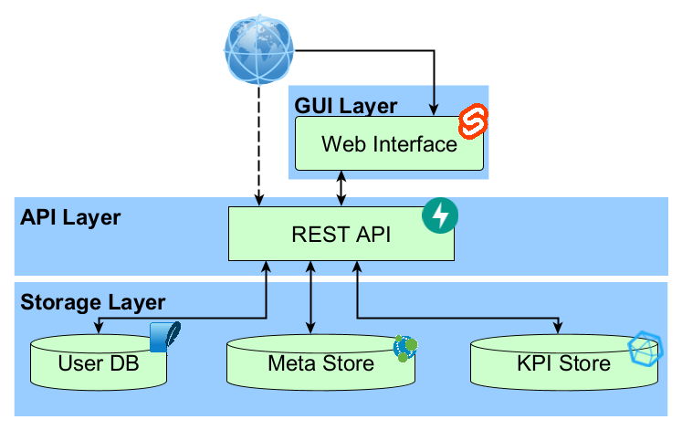
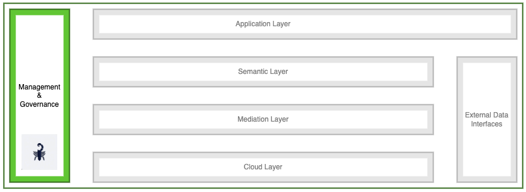

Deployment
==========

This page is currently under construction. Feel free to visit it again at a later point to find more information.

Software Architecture
---------------------

Scorpion is a system developed to monitor KPIs for services of the NFDi4Biodiversity Service Catalog. In our context, KPIs are mostly focussed on usage of a service (e.g. Number of Unique Users). The KPI measurements are submitted in a push approach, so that every service provider is responsible for submitting their KPI measurements on a monthly basis to Scorpion. The system itself is structured in several layers:

- The storage layer contains three databases. The first database is a simple SQLite3 instance used to keep track of registered users and their roles. Second, a Neo4j instance is hosted to store the KPI profiles of all services. Lastly, an InfluxDB instance is used to store the KPI measurements
- The API layer implements a REST API that is partially made available to external users. Besides that, it is used to facilitate the communication between the back- and front-end. 
- The Graphical User Interface offers a submission form for monthly KPI measurements of a service, a basic visualization of the stored results and an administration view.

    System architecture of Scorpion.

   

RDC Integration
---------------

Scorpion is part of the RDC management and governance layer. It collects and visualizes KPIs useful for the review process. Scorpion offers a REST API as well as a form in the GUI to submit KPIs for a service on a monthly basis. Additionally, it offers basic visualisations of the measurements to help the NFDI4Biodiversity Service Review Committee to decide what measures need to be taken to ensure the service complies with our definition of quality.

    Integration into the RDC.

Further information specific to the NFDI4Biodiversty instance can be found in the `KnowledgeBase <https://kb.gfbio.org/display/KB/Service+Monitoring%3A+Scorpion>`_.

Installation Guide
------------------

Here you will find further information about the necessary steps to set up your own Scorpion instance.