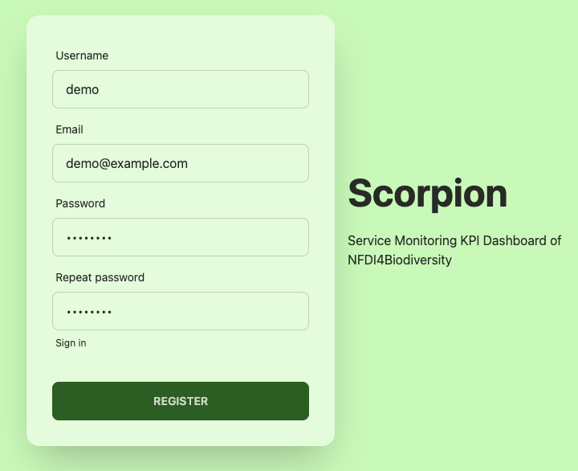
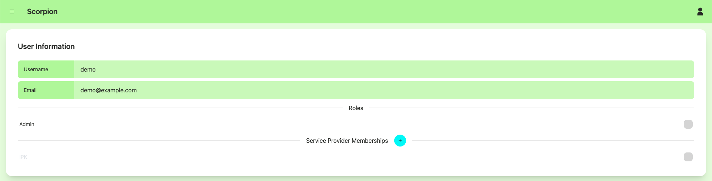
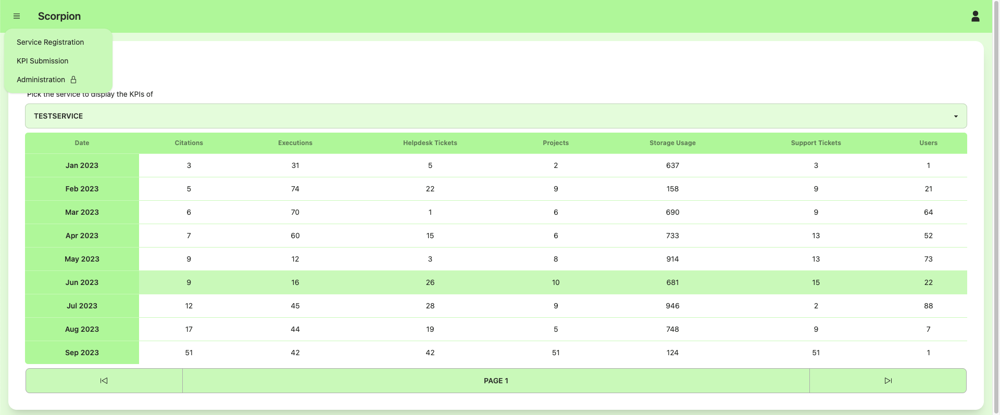
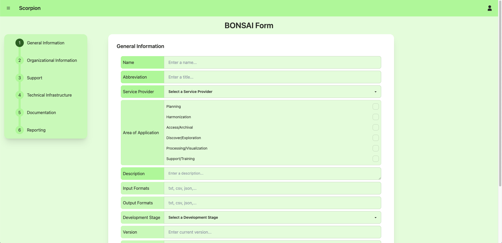
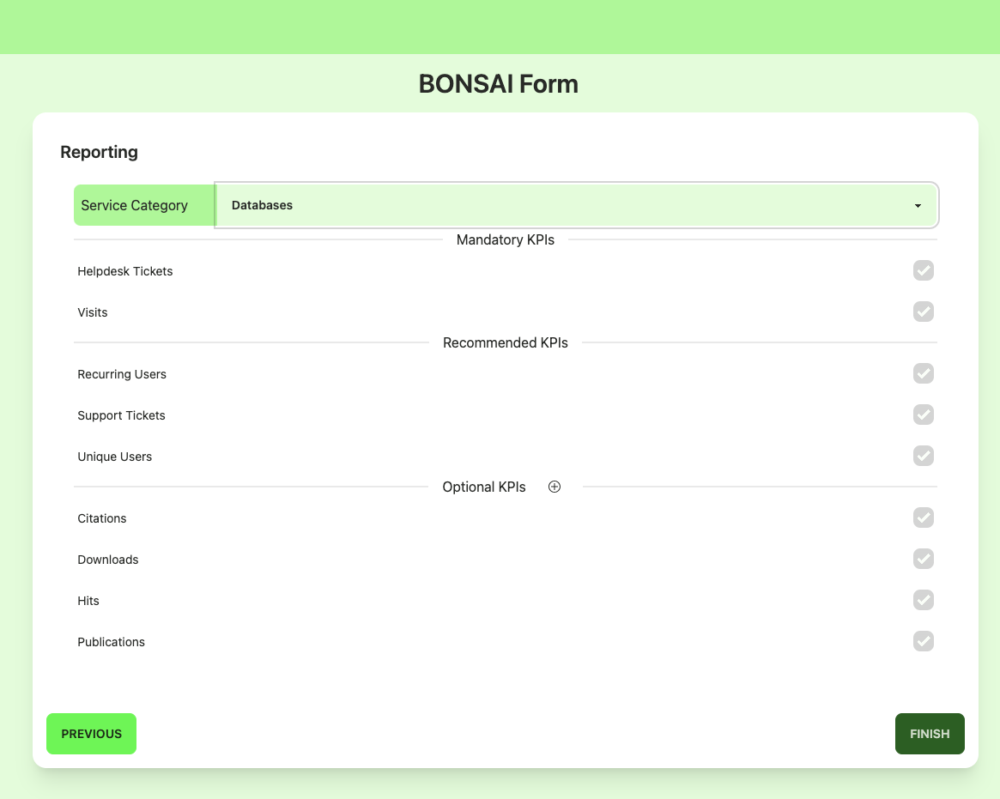
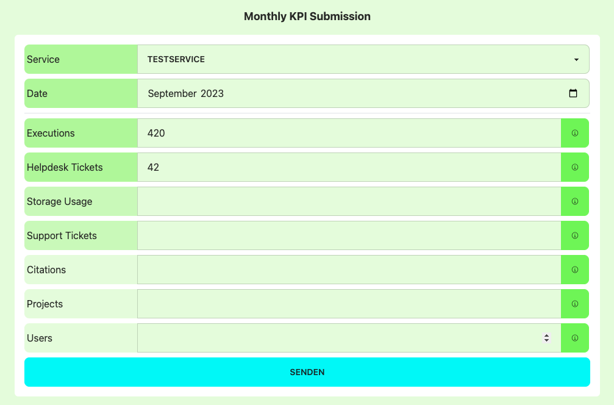
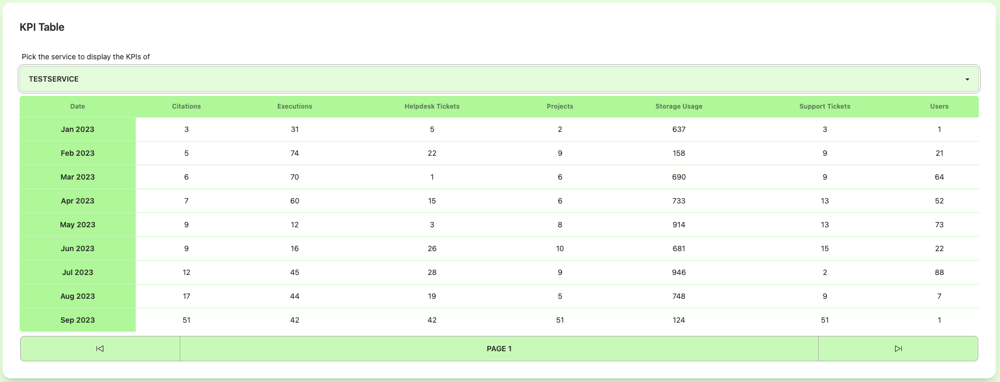
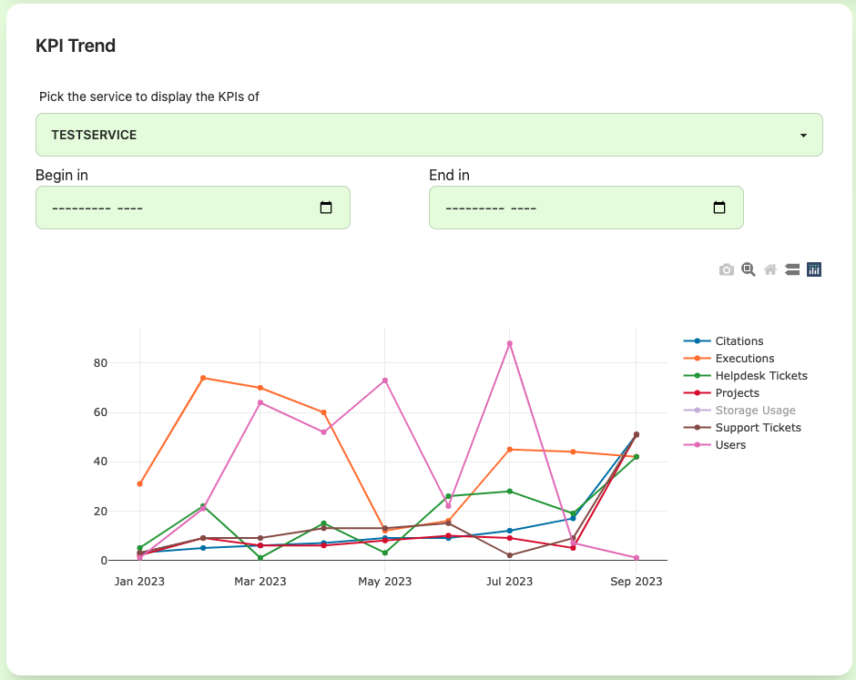

Usage
=====

Registration
------------

The registration process for Scorpion is a two-step process. 
First, the new user needs to fill out the registration form. 

    Registration Form

After that a request is added to the administration panel and 
an administrator needs to approve or decline the request. If 
it is approved, the user can sign either using their username 
and password or email and password as credentials.

This provides basic access to Scorpion. The newly registered
user has access to all visualization features. To register new
services or submit measurements for existing services, membership
to a service provider needs to be requested. For this the user 
can visit the `Profile` from the `User Menu`.

.. figure:: images/user-menu.png
    :alt: `User Menu` in the top right hand corner.

    `User Menu` with entry `Profile` highlighted.

From the `Profile` the user can request membership by opening the 
dialog with the `Add Button` and selecting the relevant service 
provider from the drop down menu. After sending the request, an 
administrator can decide whether to accept or decline the request.

    
    `Profile` view with an pending request for membership to a service provider.

Service Registration via BONSAI Form
------------------------------------

To register a new service with Scorpion, one visits the `Service Registration` view, which can be found in the top left hand menu.

    `Context menu` with navigation to the Service Registration.

The service registration is implemented with the BONSAI Form (NFDI4Biodiversity onboarding of services application form). The BONSAI Form is structured into a multi-step form with mandatory and recommended fields. 
The recommended fields are highlighted by a darker background and until filled prevent moving to the next step.
Steps include:
- General information
- Organization information
- Support
- Technical infrastructure
- Documentation
- Reporting

    `BONSAI Form` used to register services.

The last step `Reporting` defines the service's KPI set. Here, the user selects a service category, which adds several KPIs with differing necessities. Additionally, the user can choose to add other KPIs as optional to their service.

    `Reporting` step of the `BONSAI Form` with category selection and option to add optional KPIs.

KPI Submission using the Web Interface
--------------------------------------

The KPI Submission using the Web Interface is only possible monthwise. From the `Context Menu` in the top left hand corner the user needs to navigate to `KPI Submission`, where they can select from all services of all service providers they are member of. After a service is selected, the service KPI set is loaded and the user can select for which month they want to submit the KPI measurements for.
After entering all measurements, they click `Submit` and a pop up message confirms that the measurements are stored.

    Monthly KPI Submission using the Web Interface. The user selects the service and the month and enters all KPI measurements.

KPI Visualizations
--------------

Users can visualize the KPI measurements of all services registered with Scorpion. This includes services of providers that they are not member of. 
Measurements can either be visualized with a table:

or as a line chart:

