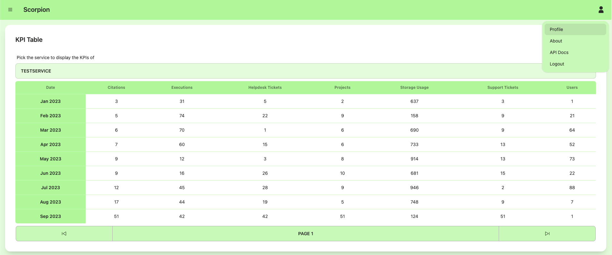

Usage
=====

Registration
------------

The registration process for Scorpion is a two-step process. 
First, the new user needs to fill out the registration form. 

.. figure:: /docs/img/registration-form.png
    :alt: Registration Form

After that a request is added to the administration panel and 
an administrator needs to approve or decline the request. If 
it is approved, the user can sign either using their username 
and password or email and password as credentials.

This provides basic access to Scorpion. The newly registered
user has access to all visualization features. To register new
services or submit measurements for existing services, membership
to a service provider needs to be requested. For this the user 
can visit the `Profile` from the `User Menu`.

Service Registration via BONSAI Form
------------------------------------

KPI Submission using the Web Interface
--------------------------------------

Visualizations
--------------