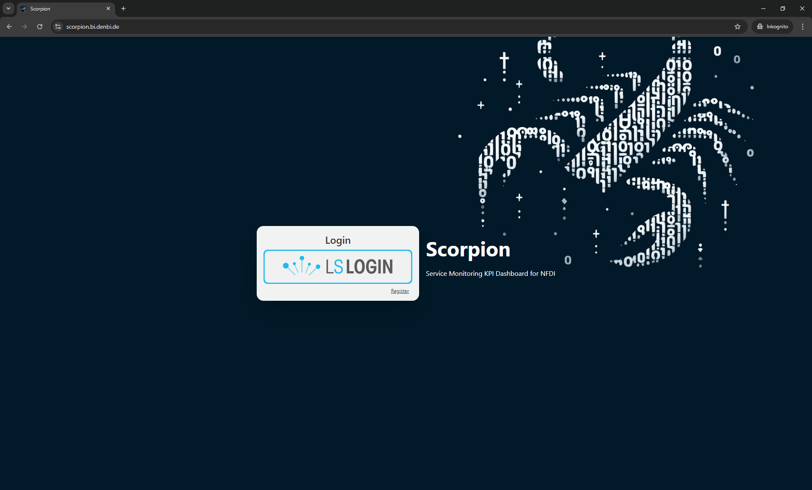

# Getting Started

This guide will walk you through the essential steps to get started, ensuring you can navigate and use Scorpion effectively. First, we'll cover the registration process, guiding you through signing up and accessing your account. Following this, we'll delve into the various features the Scorpion web interface offers, including registering with service providers, submitting KPI, and visualizing these metrics for informed decision-making. Each section is designed to be intuitive, but don't hesitate to reach out if you encounter any difficulties. 

## Registration and Sign In

To begin your journey with Scorpion, you'll need to complete the registration process. We utilize the AAI solution LS-Login(1) for secure and streamlined access management. Here's how you can register and sign in:
{ .annotate }

1.   Life Science Login enables researchers to use their home organisation credentials or community or other identities (e.g. Google, Linkedin, LS ID) to sign in and access data and services they need.

### Registering Through LS Login

Scorpion uses a virtual organization that you need to be member of in order to sign in. To accomplish this follow these steps:

1. Access the Registration Form: You can find a link to the registration form when accessing [Scorpion](https://scorpion.bi.denbi.de).
2. Sign in to LS Login: You need to sign in to LS Login in order to link your LS Account to the virtual organization.
2. Complete the Form: Provide all the necessary information as prompted. 
3. Submit Your Application: Once you've filled out the form, submit it. We will review your application - usually within a few business days.

### Sign-In Using Home Organization Credentials
Once approved, you can sign in to Scorpion using your home organization's credentials. This approach uses established connections between organizations to offer a smooth login process.

### Alternative Sign-In Method: LifeScience Hostel
In cases where your home organization cannot be used for authentication, you have the option to sign in using a local LS Login Username and Password. This alternative allows you to access Scorpion even when direct integration with your institution isn't available.

By following these steps, you'll be able to successfully register and sign in to Scorpion, ready to explore its features.

## Navigating the Interface

### Registration to Service Providers

After successfully logging in, you'll find several key areas accessible from the top right corner of the page, represented by a user icon. This area provides quick access to important functionalities such as signing out, viewing the "About" page, managing your profile, and accessing the API documentation.

Clicking on the User Icon allows you to navigate to the Profile. In the profile you can find a overview of personal information known to Scorpion. 

Within your profile, you'll find a dedicated section titled "Service Provider Memberships." Here, you'll see a button featuring a plus icon. Clicking on this button opens a modal window where you can select a Service Provider(1) from a list. After selecting your desired Service Provider, simply click `SUBMIT` to apply for registration with them.
{ .annotate }

1.  A Service Provider is an organization that provides services. It allows access control to groups of services, streamlining the registration process.

Once you've submitted your application, it's reviewed by a system administrator. Upon approval, you gain the ability to register new services under the selected Service Provider and start submitting KPI measurements related to those services.

This streamlined process ensures that you can efficiently manage your interactions with various Service Providers directly through Scorpion, enhancing your overall experience and productivity.

### Service Registration
To register a new service, follow these steps to navigate through the service registration process. This involves filling out a comprehensive form that gathers essential details about your service.

Within the top left menu, click on "Service Registration." This directs you to the service registration form.

This form is divided into two pages, designed to collect necessary information about your service in a structured manner. On the first page of the form, you'll be asked to provide basic information about your service.

The second page focuses on defining the KPI for your service. First, you need to select a Service Category(1). Choose the category that best fits your service from the provided options. This will select KPI that are relevant to your service category. These KPI come with varying levels of necessity — mandatory, recommended, or optional.
{ .annotate }

1.  The service categories are defined as:
    - Databases
    - Tools
    - Webapplications
    - Libraries
    - Workflows
    - Supports
    - Trainings

Additionally, you have the option to add Optional KPI from the remaining pool of KPI. These are not strictly required but can provide valuable insights into your service's performance.

After completing both pages of the form with accurate information, proceed to submit your service registration. There is no review process attached to this, so you will be able to submit KPI measurements right away.

### KPI Submission

Within the top left menu, click on "KPI Submission". This directs you to the KPI submission form. 

In this form, select the service that you want to submit KPI for. The services available will depend on the Service Providers you are member of. After this selection the form will automatically update itself and load the KPI associated to the service. Don't forget to fill out the month that you want to submit the measurements for. 

!!! note "Note"
    
    If the date selection is not rendered correctly the format should be `YYYY-MM`

Fill out the form and click the `SUBMIT` button at the bottom of the form. Green notifications will appear for the sucessfully submitted KPI measurements. And the form will reset afterwards. The results are successfully submitted and you can visualize them.

### Visualizations

There are multiple visualizations available within Scorpion. You can find them on the Home page where you are redirected after login, or by clicking the "Scorpion" button in the navigation header. 

!!! note "Note"
    
    You will notice, that you can access the results of more services than you can submit measurements for. This is because Scorpion grants read access to all users for all services of all service providers.

First visualization is in tabular form. You can select a service and the KPI measurements are displayed in pages of size 12. To paginate the results, use the paginator below the table. It allows you to either navigate to the next or previous page or directly to a specific page.

On the bottom left, you can find a section called "KPI Trend". This section allows you to plot a line chart for the KPI measurements of a service within a time span.

Next to this, you find the "Services Overview". Here you can plot pie charts of all services available in Scorpion and filter by consortia. 

This concludes the introduction to the web interface. Feel free to contact us if you require further details on how to use Scorpion. If you want to learn how to use the Scorpion API to submit your measurements, check out our [__Tutorial__](api.md) on this topic.